<div id="top-header" style="with:100%;height:auto;text-align:right;">
    
</div>

# INFRASTRUCTURE PLATFORM

[](https://shields.io/)
[](./)
[](./LICENSE)

# NGINX 1.28, PHP 8.3, POSTGRES 16.4
<br>

This Infrastructure Platform repository is designed for back-end projects and provides three separate platforms:

- API Platform: Linux Alpine version 3.22 + NGINX version 1.28 *(or the latest on Alpine Package Keeper)* + PHP FPM 8.3
- Database Platform: Linux Alpine version 3.22 + Postgres 16.4
- Mail Service Platform: Linux Alpine version 3.12 + Mailhog 1.0

The goal of this repository is to offer developers a consistent framework for local development, mirroring real-world deployment scenarios. In production, the API may be deployed on an AWS EC2 / GCP GCE or instance or distributed across Kubernetes pods, while the database would reside on an AWS RDS instance. thus, network connection between platforms are decoupled.

Platform engineering is the discipline of creating and managing an internal developer platform (IDP) to provide developers with self-service tools, automated workflows, and standardized environments. By reducing cognitive load and complexity, it allows software engineering teams to innovate faster and more efficiently, building on the principles of DevOps. The IDP acts like a product, where developers are customers, and aims to streamline the entire software development lifecycle, from building and testing to deploying and monitoring.

### Key principles and goals

- Self-service: Provide developers with easy-to-use tools and automated workflows to manage their own infrastructure needs without having to file tickets or rely on other teams.
- Standardization: Use standardized tools and environments to ensure consistency, reliability, and security across projects.
- Reduced cognitive load: Abstract away underlying complexity so developers can focus on writing code and delivering business value rather than managing infrastructure details.
- Developer experience: Build a positive and productive environment for developers, making them feel empowered and less frustrated.
- Operational efficiency: Automate repetitive tasks and standardize processes to improve the speed and reliability of software delivery.

### How it works

- Internal Developer Platform (IDP): A dedicated platform built by the platform engineering team that provides a curated set of tools, services, and infrastructure.
- Golden Paths: Predefined, optimized workflows and best practices that developers can follow to accomplish common tasks quickly and easily.
- Treating the platform as a product: Platform engineers treat their IDP like a product, with developers as their customers, to ensure it meets the needs of the organization.
<br>

### Read more:

- [What is platform engineering? - IBM](https://www.ibm.com/think/topics/platform-engineering)
- [Understanding platform engineering - Red Hat](https://www.redhat.com/en/topics/platform-engineering)
- [Platform engineering - Prescriptive Guidance - AWS](https://docs.aws.amazon.com/prescriptive-guidance/latest/aws-caf-platform-perspective/platform-eng.html)
- [What is an internal developer platform (IDP)? - Google Cloud](https://cloud.google.com/solutions/platform-engineering)
- [What is platform engineering? - Microsoft](https://learn.microsoft.com/en-us/platform-engineering/what-is-platform-engineering)
- [What is Platform engineering? - Github](https://github.com/resources/articles/what-is-platform-engineering)
<br>

## Contents:

- [Requirements](#requirements)
- [Platform Features](#platform-features)
- [API Platform](#api-settings)
- [Database Platform](#db-settings)
- [Mail Service Platform](#mailer-settings)
- [Set up Docker Containers](#setup-containers)
- [Create Docker Containers](#create-containers)
- [Supervisord](#supervisord)
- [GNU Make file recipes](#make-help)
- [Use this Platform Repository for REST API project](#platform-usage)
<br><br>

## <a id="requirements"></a>Requirements


Despite Docker’s cross-platform compatibility, for intermediate to advanced software development on environments other than Windows NT or macOS, automating the platform build and streamlining the process of starting feature development is crucial. This automation enables a more dynamic and efficient software development lifecycle.

- Docker
- Docker Compose
- GNU Make *(otherwise commands must be executed manually)*

| Dev machine   | Machine's features                                                                            |
| ------------- | --------------------------------------------------------------------------------------------- |
| CPU           | Linux *(x64 - x86)* /  MacOS Intel *(x64 - x86)*, or M1                                       |
| RAM           | 2G *(avarage)*                                                                                |
| DISK          | 3 GB *(though is much less, its usage could be incremented depending on the project usage)*.  |
<br>

## <a id="platform-features"></a>Platform Features


It can be installed the most known **PHP** frameworks:

- [Symfony](https://symfony.com/)
- [Laravel](https://laravel.com/)
- [Zend](https://framework.zend.com/)
- [Codeigniter](https://codeigniter.es/)
- [Phalcon](https://phalcon.io/es-es)
- [CakePHP](https://cakephp.org/)
- [Yii](https://www.yiiframework.com/)
- Others...
<br>

Take into account that each framework will demand its specific configuration from inside container.
<br><br>

## <a id="api-settings"></a>API Platform

This platform has it own Makefile recipes to manage the container and it recipes can be manage from its directory or by a centralized Makefile at the root of the platform repository. But, **if no GNU Make installed on developer's machine** there is a `.env.example` file to be copied as `.env` with the variables required to build the container by `docker-compose.yml`.

Environment variables are highly important for maintaining the platform. Try to Keep them whatever the Docker commands case.

API environment: `./platform/nginx-php/docker/.env`
```bash
COMPOSE_PROJECT_LEAD="myproj"
COMPOSE_PROJECT_CNET="mp-dev"
COMPOSE_PROJECT_IMGK="alpine3.22-nginx1.28-php8.3"
COMPOSE_PROJECT_NAME="mp-apirest-dev"
COMPOSE_PROJECT_HOST="127.0.0.1"
COMPOSE_PROJECT_PORT=7501
COMPOSE_PROJECT_PATH="../../../apirest"
COMPOSE_PROJECT_MEM="128M"
COMPOSE_PROJECT_SWAP="512M"
COMPOSE_PROJECT_USER="myproj"
COMPOSE_PROJECT_GROUP="myproj"
```

> Note: Though this platform aim is for REST API services, it also can be used for monolith web applications

<br>

<font color="orange"><b>IMPORTANT:</b></font>

Although the project aims to keep platform settings consistent across machines, some runtime requirements can differ between environments *(for example: memory limits or which supervisord services should be active)*.

To support environment-specific differences, there is a sample supervisor configuration directory:
`./platform/nginx-php-8.3/docker/config/supervisor/conf.d-sample`

Before building the container you must copy that directory to:
`./platform/nginx-php-8.3/docker/config/supervisor/conf.d`

Make sure the copied conf.d contains at least the service files needed to run Nginx and PHP-FPM (for example, supervisor program entries for nginx and php-fpm).
```bash
.
├── platform
│   ├── nginx-php-8.3
│   │   ├── docker
│   │   │   ├── config
│   │   │   │   ├── nginx
│   │   │   │   │   ├── conf.d
│   │   │   │   │   │   └── default.conf # required
│   │   │   │   │   ├── conf.d-sample
│   │   │   │   │   │   └── default.conf
│   │   │   │   │   └── nginx.conf # required
│   │   │   │   ├── php
│   │   │   │   │   ├── conf.d
│   │   │   │   │   │   ├── fpm-pool.conf # required
│   │   │   │   │   │   ├── php.ini # required
│   │   │   │   │   │   └── xdebug.ini # optional if it in use
│   │   │   │   │   └── conf.d-sample
│   │   │   │   │       ├── fpm-pool.conf
│   │   │   │   │       ├── php.ini
│   │   │   │   │       └── xdebug.ini
│   │   │   │   └── supervisor
│   │   │   │       ├── conf.d
│   │   │   │       │   ├── nginx.conf # required
│   │   │   │       │   ├── php-fpm.conf # required
│   │   │   │       │   └── worker.conf # optional if it in use
│   │   │   │       ├── conf.d-sample
│   │   │   │       │   ├── nginx.conf
│   │   │   │       │   ├── php-fpm.conf
│   │   │   │       │   └── worker.conf
│   │   │   │       └── supervisord.conf # required
│   │   │   ├── .env
│   │   │   ├── docker-compose.yml
│   │   │   └── Dockerfile
│   │   │
│   │   └── ...
│   │
│   └── ...
│
└── ...
```

This approach lets developers run additional worker processes locally without changing the shared platform settings. If you need to update Nginx, PHP, or supervisord configurations on a running container, there are Makefile recipes in `./platform/nginx-php-8.3/Makefile` that can apply changes *(reload or update services)* without destroying and rebuilding the container. Check the Makefile for available targets and usage by executing `$ make help` in its directory.
<br><br>

## <a id="db-settings"></a>Database Platform

Inside `./platform/pgsql-16.4` there are a dedicated GNU Make file and the main Docker directory with the required scripts to build the required platform configuration adapted from [PostgreSQL GitHub repository source](https://github.com/docker-library/postgres/blob/master/16/alpine3.22/docker-entrypoint.sh)

Content:
- Linux Alpine version 3.22
- Postgres 16.4
<br>

<font color="orange"><b>IMPORTANT:</b></font> There is a `.env.example` file with the variables required to build the container by `docker-compose.yml` file to create the container if no GNU Make is available on developer's machine. Otherwise, it is not required to create its `.env` manually file for building the container.

Database environment: `./platform/pgsql-16.4/docker/.env`
```bash
COMPOSE_PROJECT_LEAD="myproj"
COMPOSE_PROJECT_CNET="mp-dev"
COMPOSE_PROJECT_IMGK="alpine3.22-pgsql-16.4"
COMPOSE_PROJECT_NAME="mp-pgsql-dev"
COMPOSE_PROJECT_HOST="127.0.0.1"
COMPOSE_PROJECT_PORT=7500
COMPOSE_PROJECT_MEM="128M"
COMPOSE_PROJECT_SWAP="512M"
POSTGRES_DATABASE=myproj_local
POSTGRES_USER=myproj
POSTGRES_PASSWORD="J4YPuJaieJ35gNAOSQQor87s82q2eUS1"
```
<br>

## <a id="mailer-settings"></a>Mail Service Platform

Inside `./platform/mailhog-1.0` there are a dedicated GNU Make file and the main Docker directory with the required scripts to build the required platform configuration adapted from [MailHog GitHub repository source](https://github.com/mailhog/MailHog)

Content:
- Linux Alpine version 3.12
- MailHog 1.0.1
<br>

<font color="orange"><b>IMPORTANT:</b></font> There is a `.env.example` file with the variables required to build the container by `docker-compose.yml` file to create the container if no GNU Make is available on developer's machine. Otherwise, it is not required to create its `.env` manually file for building the container.

Database environment: `./platform/mailhog-1.0/docker/.env`
```bash
COMPOSE_PROJECT_LEAD="myproj"
COMPOSE_PROJECT_CNET="mp-dev"
COMPOSE_PROJECT_IMGK="alpine-3.22-mailhog"
COMPOSE_PROJECT_HOST="127.0.0.1"
COMPOSE_PROJECT_PORT=7504    # Port to send e-mail by PHP script
COMPOSE_PROJECT_NAME="mp-mailhog-dev"
COMPOSE_PROJECT_MEM="128M"
COMPOSE_PROJECT_SWAP="512M"
COMPOSE_PROJECT_APP_PORT="7505" # Port to see on browser the mail sent
```
<br>

## <a id="setup-containers"></a>Configure Docker Containers

Create the root `./.env` file from the [./.env.example](./.env.example) and follow its description to configure the platforms. The end result would be like this:
```bash
SUDO=sudo
DOCKER=sudo docker
DOCKER_COMPOSE=sudo docker compose

PROJECT_NAME="MY PROJECT"
PROJECT_LEAD=myproj
PROJECT_HOST="127.0.0.1"
PROJECT_CNET=mp-dev

APIREST_PLTF=nginx-php
APIREST_IMGK=alpine3.21-nginx1.28-php8.3
APIREST_PORT=7501
APIREST_BIND="../../../apirest"
APIREST_CAAS=mp-apirest-dev
APIREST_CAAS_USER=myproj
APIREST_CAAS_GROUP=myproj
APIREST_CAAS_MEM=128M
APIREST_CAAS_SWAP=512M
APIREST_GIT_SSH=~/.ssh/id_rsa
APIREST_GIT_HOST=github.org
APIREST_GIT_BRANCH=develop
APIREST_DOMAIN=

DATABASE_PLTF=pgsql-16.4
DATABASE_IMGK=alpine3.22-pgsql-16.4
DATABASE_PORT=7500
DATABASE_CAAS=mp-pgsql-dev
DATABASE_CAAS_MEM=128M
DATABASE_CAAS_SWAP=512M
DATABASE_ROOT="sk5U2phvnjAMRe2wy0aD0ztCQaDusywp"
DATABASE_NAME=myproj_local
DATABASE_USER=myproj
DATABASE_PASS="J4YPuJaieJ35gNAOSQQor87s82q2eUS1"
DATABASE_PATH="/resources/database/"
DATABASE_INIT=pgsql-init.sql
DATABASE_BACK=pgsql-backup.sql

MAILER_PLTF=mailhog-1.0
MAILER_IMGK=alpine-3.12-mailhog-1.0
MAILER_PORT=7502    # Port to send e-mail by PHP script
MAILER_CAAS=mp-mailhog-dev
MAILER_CAAS_MEM=128M
MAILER_CAAS_SWAP=512M
MAILER_APP_PORT=7503    # Port to see on browser the mail sent
```

Once the environment file is set, create each Docker environment file by the automated commands using GNU Make:

Set up the API container
```bash
$ make apirest-set
```
<div style="with:100%;height:auto;text-align:center;">
    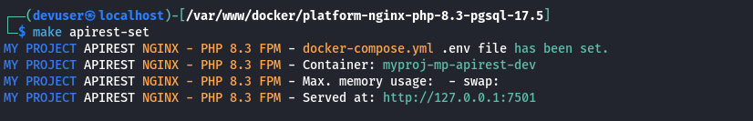
</div>

Set up the database container
```bash
$ make db-set
```
<div style="with:100%;height:auto;text-align:center;">
    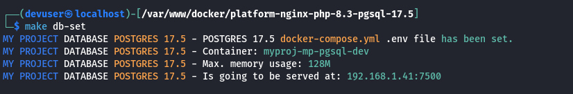
</div>

Set up the mail service container
```bash
$ make mailhog-set
```
<div style="with:100%;height:auto;text-align:center;">
    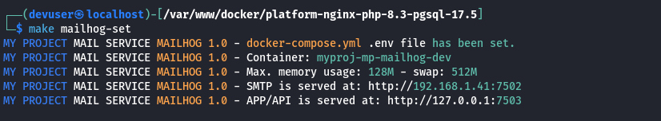
</div>
<br>

Watch the local hostname IP on which Docker serves and the ports assigned, even though the API can be accessed through `http://127.0.0.1` or `http://localhost`
```bash
$ make local-hostname
```
<div style="with:100%;height:auto;text-align:center;">
    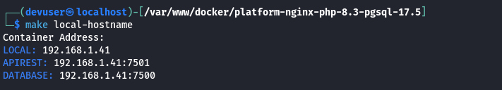
</div>
<br>

## <a id="create-containers"></a>Create and Start Docker Containers

Create and start up the API container
```bash
$ make apirest-create
```
<div style="with:100%;height:auto;text-align:center;">
    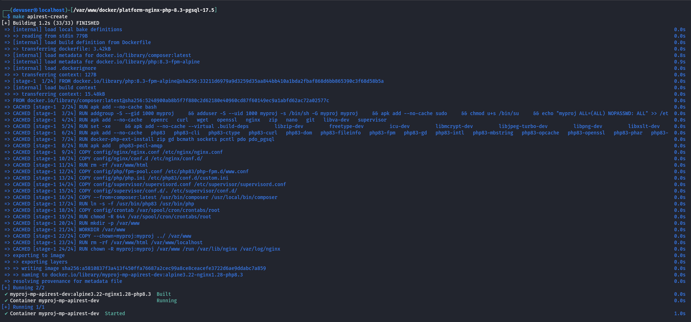
</div>
<br>

Testing container visiting localhost with the assigned port, but with no database connection established or failed because of wrong configuration
<div style="with:100%;height:auto;text-align:center;">
    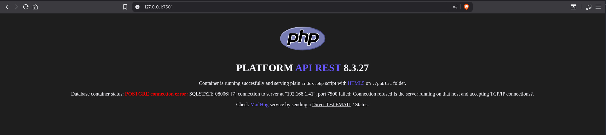
</div>
<br>

Create and start up the database container
```bash
$ make db-create
```
<div style="with:100%;height:auto;text-align:center;">
    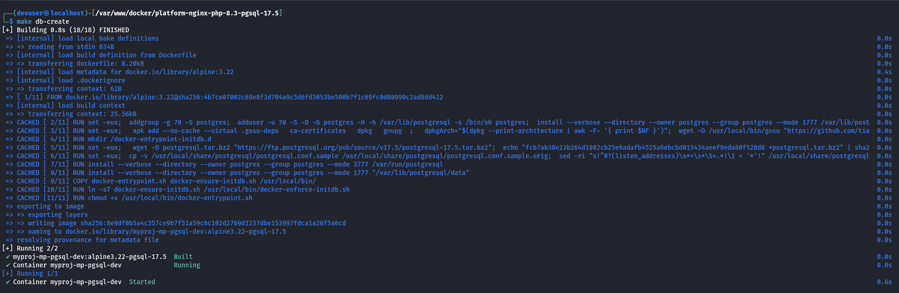
</div>
<br>

Once database service is up and running, status message will show successful connection
<div style="with:100%;height:auto;text-align:center;">
    
</div>
<br>

Create and start up the mail service container
```bash
$ make mailhog-create
```
<div style="with:100%;height:auto;text-align:center;">
    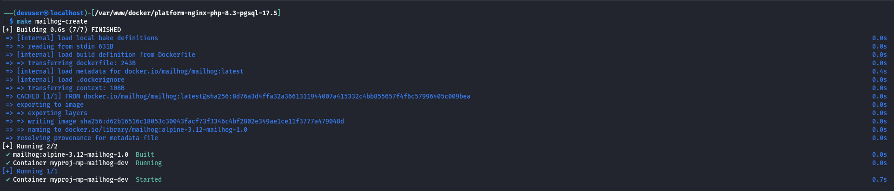
</div>
<br>

Test mail service container by clicking "Direct Test MAIL" link
<div style="with:100%;height:auto;text-align:center;">
    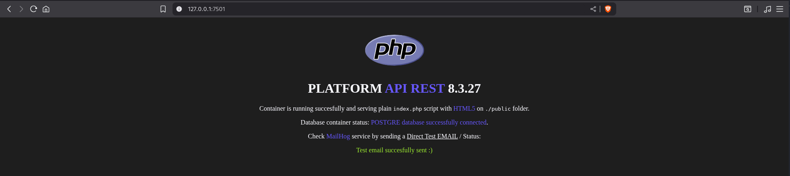
</div>
<div style="with:100%;height:auto;text-align:center;">
    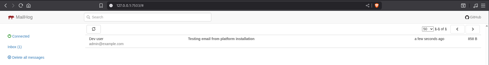
</div>
<br>


Docker information of both cointer up and running
<div style="with:100%;height:auto;text-align:center;">
    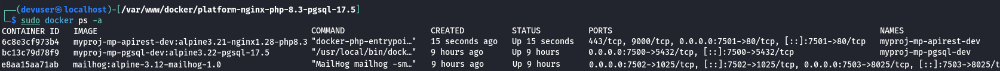
</div>
<div style="with:100%;height:auto;text-align:center;">
    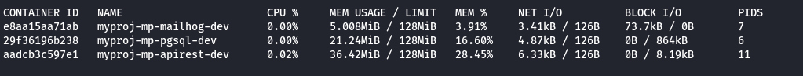
</div>
<br>

Despite each container can be stop or restarted, they can be stop and destroy both containers simultaneously to clean up locally from Docker generated cache, without affecting other containers running on the same machine.
```bash
$ yes | make apirest-destroy db-destroy mailhog-destroy
```
<div style="with:100%;height:auto;text-align:center;">
    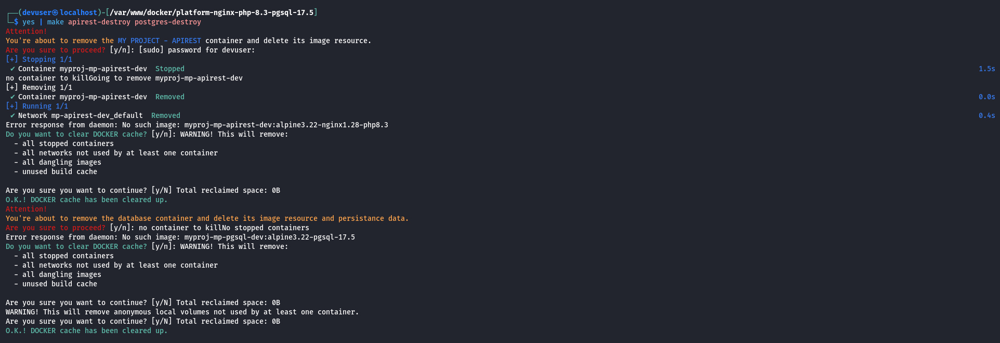
</div>

### Container Information

Remember that containers can be accesible from local IP. Use the Makefile recipe to watch container main information as the following example:
```bash
$ make apirest-info
MY PROJECT - APIREST: NGINX - PHP 8.3
Container ID.: 55c6c842acd0
Name.........: myproj-mp-apirest-dev
Image........: myproj-mp-apirest-dev:alpine3.22-nginx1.28-php8.3
Memory.......: 128M
Host.........: 127.0.0.1:7201
Hostname.....: 192.168.1.41:7201
Docker.Host..: 172.22.0.2
NetworkID....: 4233a008c3be5e3d9fe673a5a02b457530454ff3d19b3d2d6d84142ccbaa34dc
```
<br>

## <a id="supervisord"></a>Supervisord - Changes on the run

Every change needed to be set on the run, either on NGINX or PHP, you can modify the file on the container and then restart the Supervisord service. Some changes would need to be reloaded after service has been restarted.
```bash
/var/www $ sudo supervisorctl restart nginx
/var/www $ nginx -s reload
```
<br>

## <a id="make-help"></a>GNU Make file recipes

The project's main `./Makefile` contains recipes with the commands required to manage each platform's Makefile from the project root.

This streamlines the workflow for managing containers with mnemonic recipe names, avoiding the effort of remembering and typing each bash command line.

<div style="with:100%;height:auto;text-align:center;">
    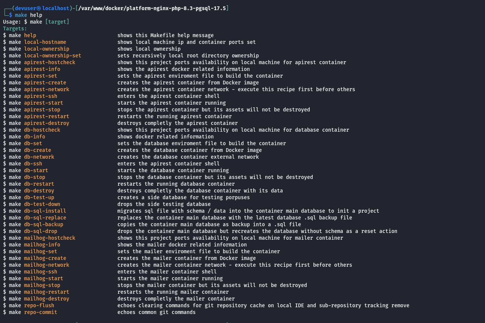
</div>
<br>

## <a id="platform-usage"></a>Use this Platform Repository for your own REST API repository

Clone the platforms repository
```bash
$ git clone https://github.com/pabloripoll/docker-platform-nginx-php-8.3-pgsql-16.4
$ cd docker-platform-nginx-php-8.3-pgsql-16.4
```

Repository directories structure overview:
```
.
├── apirest (Symfony, Laravel, etc.)
│   ├── app
│   ├── bootstrap
│   ├── vendor
│   └── ...
│
├── platform
│   ├── nginx-php
│   │   ├── docker
│   │   │   ├── config
│   │   │   ├── .env
│   │   │   ├── docker-compose.yml
│   │   │   └── Dockerfile
│   │   │
│   │   └── Makefile
│   │
│   ├── postgres-16.4
│   │   ├── docker
│   │   └── Makefile
│   │
│   └── mailhog-1.0
│       ├── docker
│       └── Makefile
├── .env
├── Makefile
└── README.md
```
<br>

Set up platforms
- Copy `.env.example` to `.env` and adjust settings (rest api port, database port, mail service port, container RAM usage, etc.)
- By configuring the PHPcontainer with e.g. `APIREST_CAAS_MEM=128M`, remember to set the same RAM value into `./platform/nginx-php/docker/config/php/php.ini`
<br>

Here’s a step-by-step guide for using this Platform repository along with your own REST API repository:

- Remove the existing `./apirest` directory contents from local and from git cache
- Install your desired repository inside `./apirest`
- Choose between Git submodule and detached repository approaches
<br>

### Managing the `apirest` Directory: Submodule vs Detached Repository

To remove the `./apirest` directory with the default installation content and install your desired repository inside it, there are two alternatives for managing both the platform and apirest repositories independently:

#### 1. **GIT Sub-module**

> Git commands can be executed **only from inside the container**.

- Remove `apirest` from local and git cache:
  ```bash
  $ rm -rfv ./apirest/* ./apirest/.[!.]*$
  $ git rm -r --cached apirest
  $ git commit -m "maint: apirest directory and its default installation removed to detach from platform repository"
  ```

- Add the desired repository as a submodule:
  ```bash
  $ git submodule add git@[vcs]:[account]/[repository].git ./apirest
  $ git commit -m "maint: apirest added as a git submodule"
  ```

- To update submodule contents:
  ```bash
  $ cd ./apirest
  $ git pull origin main  # or desired branch
  ```

- To initialize/update submodules after `git clone`:
  ```bash
  $ git submodule update --init --recursive
  ```
<br>

#### 2. **GIT Detached Repository (Recommended)**

> Git commands can be executed **whether from inside the container or on the local machine**.

- Remove `apirest` from local and git cache:
  ```bash
  $ git rm -r --cached -- "apirest/*" ":(exclude)apirest/.gitkeep"
  $ git clean -fd
  $ git reset --hard
  $ git commit -m "Remove apirest directory and its default installation"
  ```

- Clone the desired repository as a detached repository:
  ```bash
  $ git clone git@[vcs]:[account]/[repository].git ./apirest
  ```

- The `apirest` directory is now an **independent repository**, not tracked as a submodule in your main repo. You can use `git` commands freely inside `apirest` from anywhere.
<br><br>

#### **Summary Table**

| Approach         | Repo independence | Where to run git commands | Use case                        |
|------------------|------------------|--------------------------|----------------------------------|
| Submodule        | Tracked by main  | Inside container         | Main repo controls webapp version|
| Detached (rec.)  | Fully independent| Local or container       | Maximum flexibility              |

> **Note**: After new project cloned inside `./apirest`, consider adding `./apirest/.gitkeep` in it to prevent accidental tracking *(especially for detached repository)*.

<br>


## Contributing

Contributions are very welcome! Please open issues or submit PRs for improvements, new features, or bug fixes.

1. Fork the repository
2. Create your feature branch (`git checkout -b feature/YourFeature`)
3. Commit your changes (`git commit -am 'feat: Add new feature'`)
4. Push to the branch (`git push origin feature/YourFeature`)
5. Create a new Pull Request
<br><br>

## License

This project is open-sourced under the [MIT license](LICENSE).

<!-- FOOTER -->
<br>

---

<br>

- [GO TOP ⮙](#top-header)

<div style="with:100%;height:auto;text-align:right;">
    
</div>
